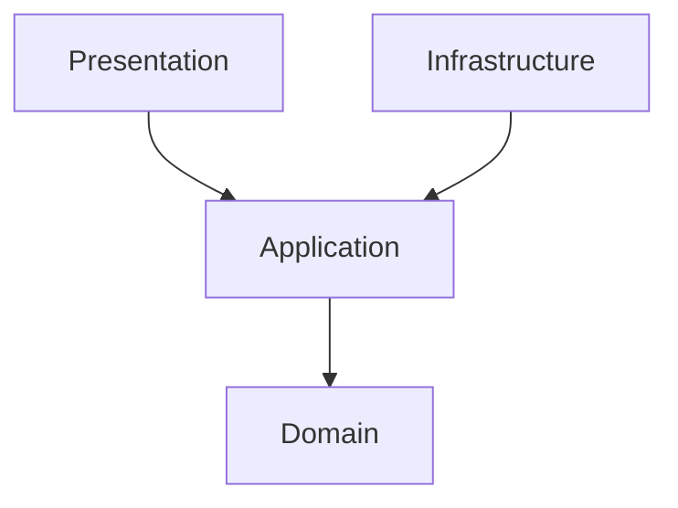

# Architecture

This project follows **Onion Architecture** (ADR-005).

## Layers

1. **Domain:** Enterprise and application business rules. Entities, value objects, domain services. No dependencies.
2. **Application:** Use cases, DTOs, ports. Depends only on Domain.
3. **Infrastructure:** Persistence (PostgreSQL/Sequelize ADR-002), Messaging (RabbitMQ ADR-004), Auth (Supabase ADR-003). Depends on Application and Domain.
4. **Presentation:** Express controllers, routes, middleware. Depends on Application.

## Dependency Rule

Dependencies point inward. Inner layers do not know about outer layers.

