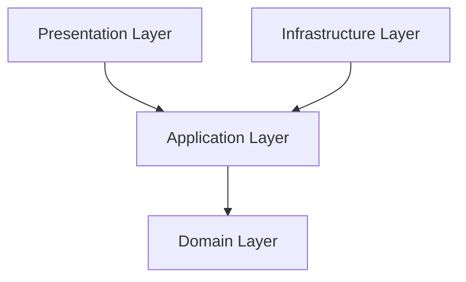

# Qatu Marketplace Backend Architecture

## 1.1 Overview

Qatu Marketplace follows the **Onion Architecture** pattern. This architecture ensures that the core domain logic remains independent of external frameworks, databases, and user interfaces. By keeping the domain isolated, we achieve a highly testable, maintainable, and scalable system.

For architectural decisions, please refer to [ADR-005 (Backend Architecture)](#) and the [Wiki](#).

## 1.2 Layers (Detailed)

### Domain Layer

- **Purpose:** Contains the core business logic, entities, and rules of the application. It is the heart of the system.
- **Components:** Entities, Value Objects, Domain Events, and Repository Interfaces.
- **Dependencies:** None. It does not depend on any outer layers.
- **What does NOT belong here:** Express.js code, database queries, ORM models, or infrastructure concerns.

### Application Layer

- **Purpose:** Orchestrates business use cases. It directs the flow of data to and from the domain layer.
- **Components:** Use Cases (Interactors), DTOs (Data Transfer Objects), and Application Interfaces.
- **Dependencies:** Depends ONLY on the Domain layer.
- **What does NOT belong here:** HTTP routing, API requests, database implementations.

### Infrastructure Layer

- **Purpose:** Provides implementations for interfaces defined in the inner layers (e.g., repositories). Handles communication with external systems.
- **Components:** Database Implementations (Sequelize), Message Brokers (RabbitMQ), External APIs, Authentication mechanisms (Supabase Auth).
- **Dependencies:** Depends on the Application and Domain layers.
- **What does NOT belong here:** Core business rules.

### Presentation Layer

- **Purpose:** Acts as the entry point for the application. Handles HTTP requests and responses.
- **Components:** Express.js Controllers, Routes, Middleware, Request Validation (Joi).
- **Dependencies:** Depends on the Application and Infrastructure layers.
- **What does NOT belong here:** Business logic or direct database queries.

## 1.3 Dependency Rule

The overriding rule of Onion Architecture is that **dependencies point inward**. Inner layers do not know anything about outer layers.



Dependency Inversion is applied heavily. When an Application Use Case needs to fetch data, it relies on a Repository Interface defined in the Domain/Application layer, while the actual implementation lives in the Infrastructure layer.

## 1.4 Folder Structure

```text
src/
├── domain/               # Core business logic
│   ├── entities/         # Domain entities (e.g., Product.js, User.js)
│   ├── valueObjects/     # Immutable value objects
│   └── repositories/     # Repository interfaces
├── application/          # Use cases and DTOs
│   ├── useCases/         # e.g., PlaceOrderUseCase.js
│   └── dtos/             # Data Transfer Objects
├── infrastructure/       # External system implementations
│   ├── database/         # Sequelize configurations and models
│   ├── repositories/     # Implementations (e.g., UserRepository.js)
│   ├── messaging/        # RabbitMQ publishers/consumers
│   └── auth/             # Supabase Auth integrations
└── presentation/         # HTTP and UI
    ├── controllers/      # Express controllers
    ├── routes/           # Express routes
    ├── middlewares/      # Express middlewares
    └── validators/       # Joi schemas
```

Files use PascalCase for classes (e.g., `PlaceOrderUseCase.js`, `UserRepository.js`).

## 1.5 Cross-Cutting Concerns

- **Authentication:** Handled via Supabase Auth in the Infrastructure layer. A custom middleware in the Presentation layer verifies the JWT token.
- **Authorization:** Enforced at the database level using PostgreSQL Row Level Security (RLS). Policies are established in migrations.
- **Validation:** Conducted in the Presentation layer using Joi schemas before requests reach the Application layer.
- **Logging:** Centralized using Pino across all layers for consistent and performant logging.
- **Messaging:** Treated as an infrastructure concern using RabbitMQ. Publishers and consumers live in the Infrastructure layer.
- **Error Handling:** Errors propagate from the Domain layer outwards, mapped to corresponding HTTP status codes in a global error handling middleware in the Presentation layer.

## 1.6 Testing Strategy per Layer

- **Domain:** Pure unit tests, no mocks needed.
- **Application:** Unit tests with mocked repositories.
- **Infrastructure:** Integration tests with Testcontainers (real PostgreSQL, RabbitMQ).
- **Presentation:** Integration tests with Supertest.

## 1.7 Architecture Decision Records

- ADR-001: Use Node.js for Backend (Link to Wiki)
- ADR-002: Use Express.js Framework (Link to Wiki)
- ADR-003: Use Supabase for Authentication (Link to Wiki)
- ADR-004: PostgreSQL as Primary Database (Link to Wiki)
- ADR-005: Backend Onion Architecture (Link to Wiki)
- ADR-006: RabbitMQ for Asynchronous Messaging (Link to Wiki)
- ADR-007: Testcontainers for Integration Tests (Link to Wiki)
- ADR-008: OpenAPI for API Documentation (Link to Wiki)

## 1.8 References

- [Wiki: Architecture/Overview](#)
- [Wiki: Architecture/Backend](#)
- [Wiki: Architecture/Data-Model](#)
- [Wiki: Architecture/Security](#)
- [Wiki: Architecture/API-Design](#)
